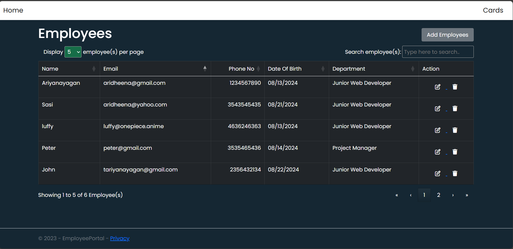
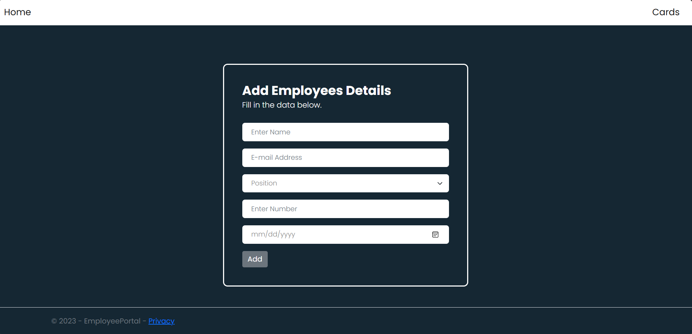

**Project Employee Portal**

The Employee Portal is a comprehensive CRUD application designed to manage employee data efficiently. Built with .NET 6.0 using the MVC (Model-View-Controller) pattern, this portal offers a structured and maintainable approach to developing web applications.

**Key Technologies:**

.NET 6.0 & MVC Pattern: Provides a robust framework for building scalable and high-performance web applications, ensuring clear separation of concerns and facilitating easy maintenance and enhancement.
SQL Server 2022: Serves as the database management system, offering reliable data storage and advanced features for handling employee information.
Entity Framework: Used for data access and management, simplifying database operations and enabling an efficient ORM (Object-Relational Mapping) approach.
Docker 3.4: Ensures consistent and portable development and deployment environments, making it easier to manage dependencies and streamline the application lifecycle.

**Design Aspects:**

Table Design: Offers a traditional and organized layout for displaying employee data, making it easy to view and manage records.
Bootstrap Card Design: Enhances user experience with a modern and visually appealing design for presenting employee information in a card format.

Here are some screenshots:
-
**Dashboard Design**

**Add Employee Form**

